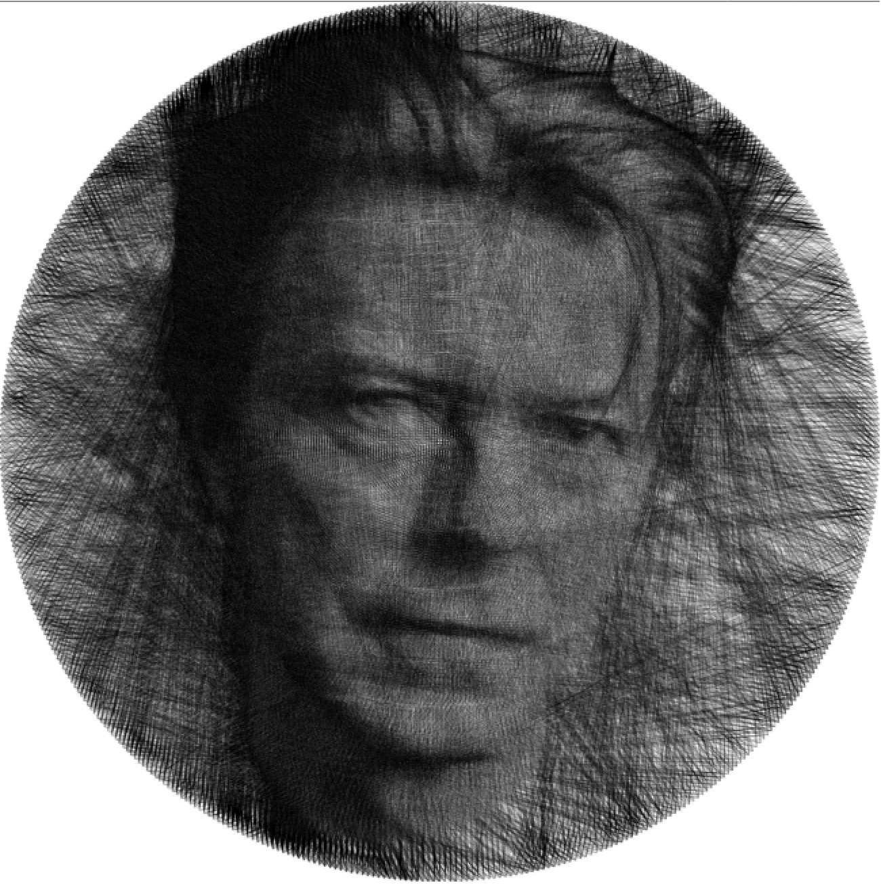
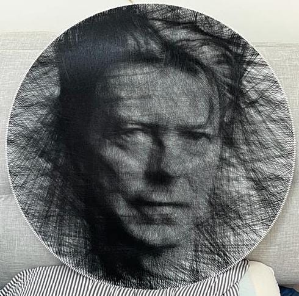
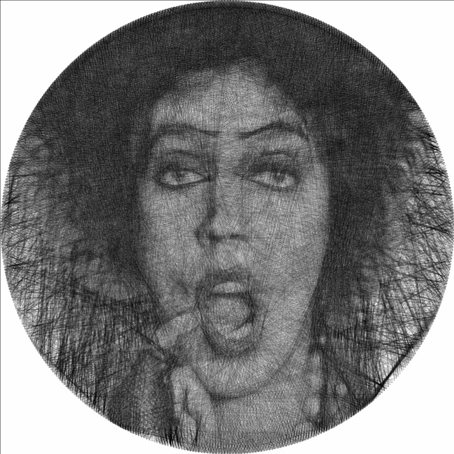
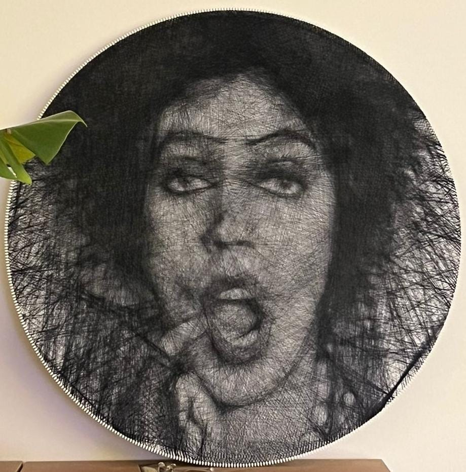
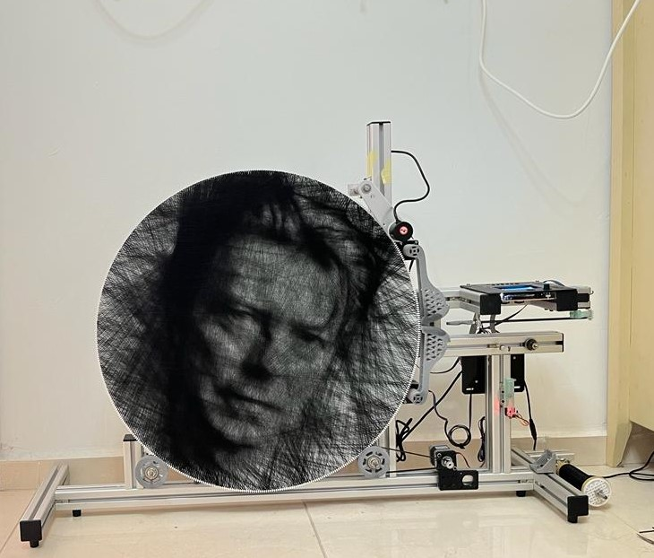
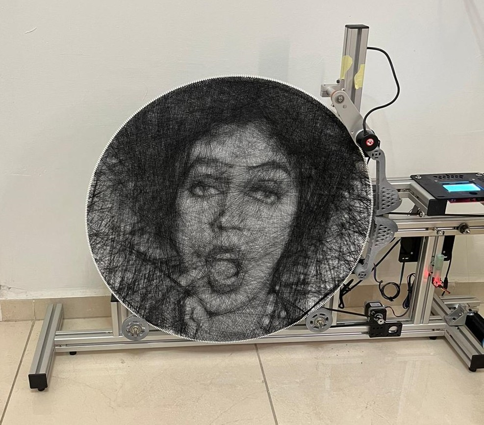
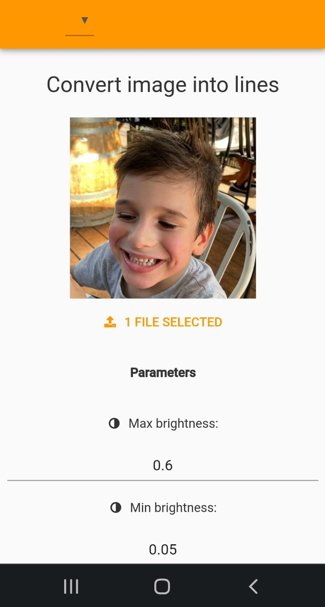
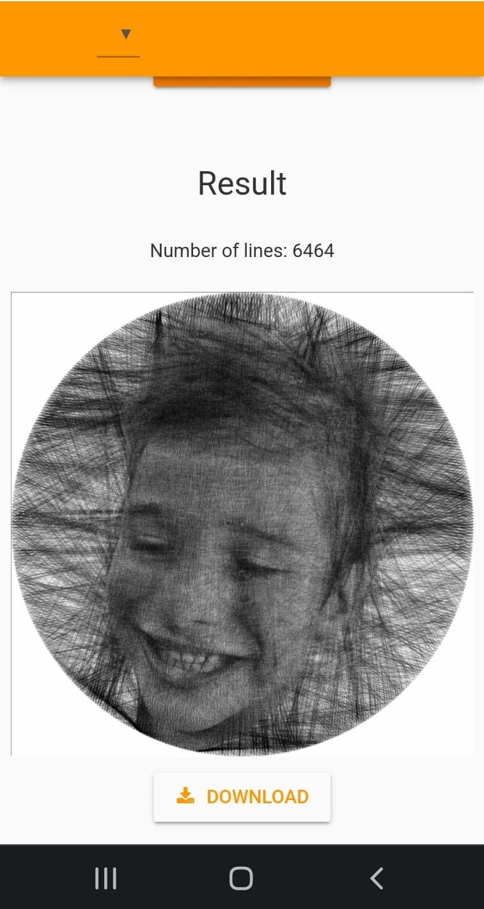

# img2strings
An art project, weaving an image from a continous string. The idea is not mine, but in my opinion my imlementation is currently the state of the art in terms of appearance quality and running time. Done together with a friend.

## Pytorch optimization
- Pytorch code calculates the optimal strings to recreate the image
- Fast running time: 10-50 seconds, depending on approximation quality (resolution is around 7000x7000 pixels)
- Implemented custom forward and backward layers
- Implemented my own Optimizer

| Simulation | Real world |
|  |  |
|  |  |

## Machine
Arduino based machine that weaves the string to create the image in the real world.
Closed loop control using stepper motors. Design code and assembly from scratch.

 

## Frontend app
Just a simple web app to be able to run the optimization conviently from any phone or computer.

 
